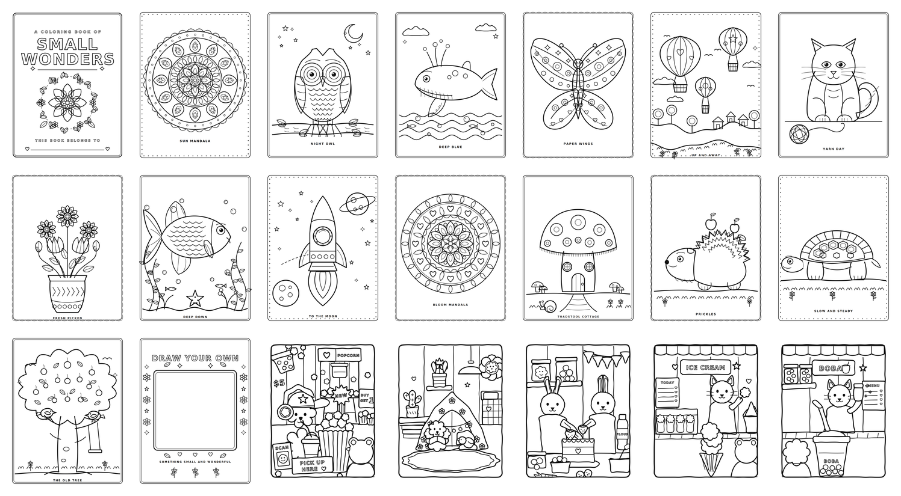

# Small Wonders — a printable coloring book

Twenty-one US Letter pages of black-line art, generated from Python. Nothing is traced or
copied: every page is drawn with the primitives in `draw.py` and `ink.py`, so the whole
book is a few hundred lines of code rather than a folder of images.



## Get the book

**[out/small-wonders-coloring-book.pdf](out/small-wonders-coloring-book.pdf)** — all 21
pages, 8.5 × 11 in, vector (no rasterized images). Print at 100% / "actual size" so the
margins stay put.

**[out/inked-scenes.pdf](out/inked-scenes.pdf)** — just the five packed scenes.

**[out/popcorn-shop-coloring-page.pdf](out/popcorn-shop-coloring-page.pdf)** — the popcorn
shop on its own, one page.

**[small-wonders-deck.pptx](small-wonders-deck.pptx)** — a 26-slide 16:9 deck that walks
through the book: title, contents, a section divider for each style, one slide per page,
and printing notes. Rebuild it with `node make_deck.js`.

Individual pages live in `out/` as SVG, and `build.py` writes a PNG of each one too.

## What's in it

| | | |
|---|---|---|
**Line-art pages**

| | | |
|---|---|---|
| 1. Cover — *Small Wonders* | 2. Sun mandala | 3. Night owl |
| 4. Deep blue (humpback) | 5. Paper wings (butterfly) | 6. Up and away (balloons) |
| 7. Yarn day (cat) | 8. Fresh picked (bouquet) | 9. Deep down (fish) |
| 10. To the moon (rocket) | 11. Bloom mandala | 12. Toadstool cottage |
| 13. Prickles (hedgehog) | 14. Slow and steady (tortoise) | 15. The old tree |
| 16. Draw your own | | |

**Inked scenes**

| | | |
|---|---|---|
| 17. Popcorn shop | 18. Blanket fort | 19. Bakery |
| 20. Ice cream parlor | 21. Boba tea bar | |

Line weights run from 4.2 pt on outer silhouettes down to 1.5 pt on texture, all round-capped,
so the enclosed areas stay big enough for a crayon and nothing fills in at print size.

## Rebuild it

```bash
pip install cairosvg pypdf pillow
python3 build.py out          # pages, PDFs
npm install pptxgenjs
node make_deck.js             # the slide deck
```

That regenerates every SVG and PNG, the combined PDF, and the standalone page PDFs.

## Files

- `draw.py` — the drawing library: paths, petals, leaves, eyes, mandala rings, scalloped
  borders, cloud and terrain helpers, and the page wrapper.
- `ink.py` — the hand-inked toolkit used by the scene pages.
- `pages_a.py` … `pages_e.py` — one function per page.
- `build.py` — renders everything and stitches the PDFs.
- `make_deck.js` — builds the slide deck with pptxgenjs.
- `qa_render.py` — redraws the deck from its own shape geometry to check fit and bounds
  (LibreOffice cannot convert `.pptx` in this sandbox).

## Two drawing styles

Pages 1-16 are clean geometric line art: unfilled outlines, layered weights, a decorative
border, and a captioned subject on white.

Pages 17-21 are packed inked scenes, closer to how sticker-style kawaii coloring pages are
drawn. `ink.py` is the toolkit for them: `wpoly`, `wcirc`, `wrect` and `wline` add a slight
hand tremble by subdividing each segment and nudging the points sideways; `fluffy` unions a
circle with just-touching bumps for poodle fluff and ice cream; `tubby` builds a striped tub
whose scalloped lip is part of the outline. Every shape takes a white fill, so each scene is
built strictly back to front with real occlusion.

## Changing a page

Each page function returns an SVG string and takes no arguments, so you can iterate on one
in isolation:

```python
import cairosvg, pages_a
svg = pages_a.owl()
cairosvg.svg2png(bytestring=svg.encode(), write_to="owl.png",
                 output_width=612, output_height=792)
```

Coordinates are in points on a 612 × 792 page, origin top-left. `MARGIN` is 48 pt and the
decorative borders sit at an inset of 26–30 pt.

## Adding a page

Write a function that returns `svg_page([...])` and add it to the `PAGES` list in
`build.py`. Add its key to `STANDALONE` there if it should also get a one-page PDF.
Three conventions worth keeping:

- **Attach appendages to the outline, not near it.** Fins, ears, and branches look detached
  if their endpoints float a few points off the silhouette. Evaluate the body's Bézier at a
  parameter `t` and start the appendage exactly there — `under_the_sea()` has a `bp()` helper
  that does this.
- **Nothing is filled**, so any line you draw inside a shape stays visible. Keep interior
  detail deliberate. `bumpy_circle()` takes an angle range for exactly this reason: the
  popcorn-shop character's head is drawn as a partial arc so the cap closes the top instead
  of the head outline showing through it.
- **Give shapes a white fill when the scene is packed.** Most of the book is unfilled
  outlines, so nothing can sit in front of anything else. Page 17 fills every shape white
  instead, which lets objects overlap and occlude properly. The page is drawn strictly
  back to front.

## License

MIT, same as the rest of the repository.
